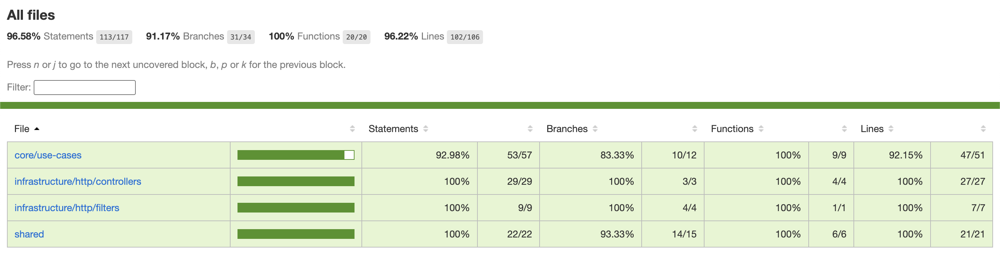

# SOAT Cart Service 🛒

Microsserviço de gerenciamento de carrinho e pedidos desenvolvido para o **Tech Challenge - Fase 4**. Este projeto aplica conceitos de **Clean Architecture**, **DDD**, **Microsserviços** e **Observabilidade**.

## 🏗 Estrutura do Projeto (Clean Architecture)

O projeto segue a rigorosa separação de interesses para garantir testabilidade e independência de ferramentas externas:

- **src/core**: Contém o coração do negócio (Entidades de Domínio e Casos de Uso). É isolado de frameworks.
- **src/infrastructure**: Contém detalhes técnicos como drivers de banco de dados (MongoDB), controladores HTTP, configurações de mensageria (SNS/SQS) e definições do NestJS.
- **src/shared**: Utilitários, constantes e helpers globais.

## 🛠 Tecnologias e Versões

| Tecnologia        | Versão     | Descrição                      |
| :---------------- | :--------- | :----------------------------- |
| **Node.js**       | `v22.12.0` | Runtime (LTS)                  |
| **NestJS**        | `11.x`     | Framework Principal            |
| **MongoDB**       | `latest`   | Banco de Dados NoSQL           |
| **TypeScript**    | `5.7.x`    | Linguagem                      |
| **OpenTelemetry** | `latest`   | Rastreamento e Observabilidade |
| **Stryker**       | `8.x`      | Testes de Mutação              |

## 🚀 Como Executar o Projeto

### 1\. Pré-requisitos

Certifique-se de ter instalado:

- **Node.js v22.12.0**
- **Docker e Docker Compose**

### 2\. Configuração de Variáveis de Ambiente

Crie um arquivo .env na raiz do projeto:

PORT=3000

MONGO_URL=mongodb://localhost:27017/soat_cart

### 3\. Subir Infraestrutura Local (Docker)

Este comando iniciará o **MongoDB** e o **Mongo Express** (Interface Visual):

docker compose up -d

> **Acesso rápido:**
>
> - **Banco de Dados (Host):** localhost:27017
> - **Interface Web (GUI):** [http://localhost:8081](https://www.google.com/search?q=http://localhost:8081)

### 4\. Instalação e Execução

npm install

npm run start:dev

## 📖 Documentação da API

A documentação interativa utiliza a interface **Scalar**, oferecendo uma experiência mais moderna para testes dos endpoints:

🔗 **URL:** [http://localhost:3000/reference](https://www.google.com/search?q=http://localhost:3000/reference)

## 🧪 Qualidade de Código e Testes

O projeto exige uma cobertura mínima de **80%**. Utilizamos testes unitários e testes de mutação para validar a eficácia da suite de testes.

npm run test (Executar unitários)

npm run test:cov (Gerar cobertura)

npm run test:mutation (Executar Stryker)

## 📡 Arquitetura de Microsserviços

Este serviço foi projetado para ser totalmente desacoplado:

1.  **Comunicação Assíncrona:** Integração via **AWS SNS/SQS**.
2.  **Banco de Dados Isolado:** Utiliza uma instância dedicada de MongoDB.
3.  **Tracing:** Implementação de **OpenTelemetry**.
    s
